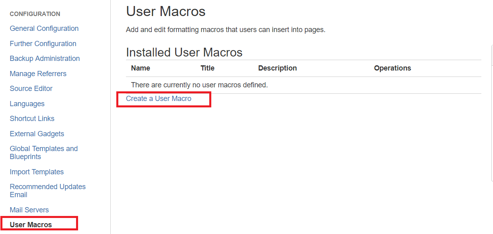
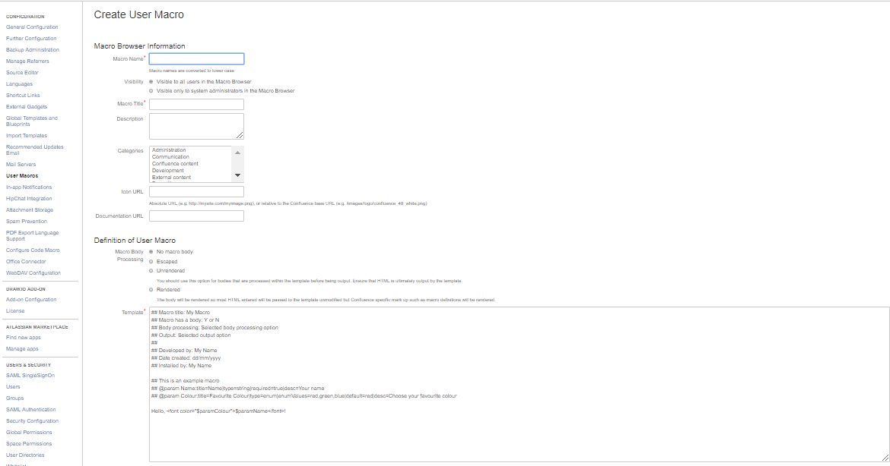

# How to copy CPS Macros
- Navigate to User Macros from General Configuration
- click on User Macros from left hand menu
 
- click on create user macro

- Paste all details to respective text boxes which are copied from CPS user macros
- Save the Macro
