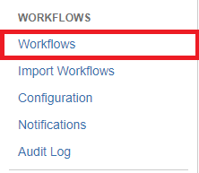
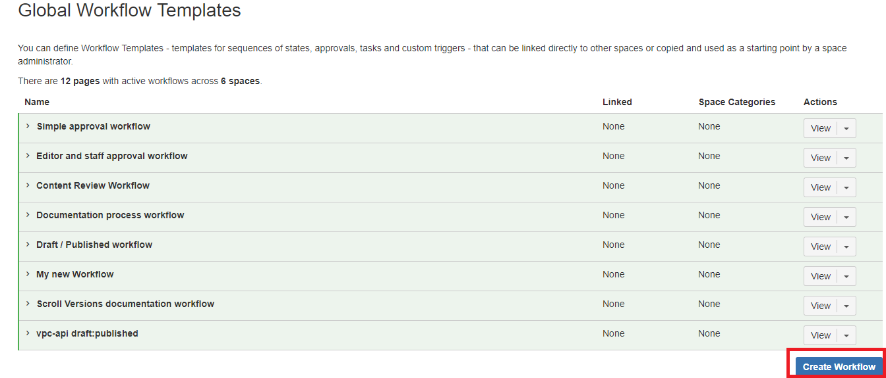
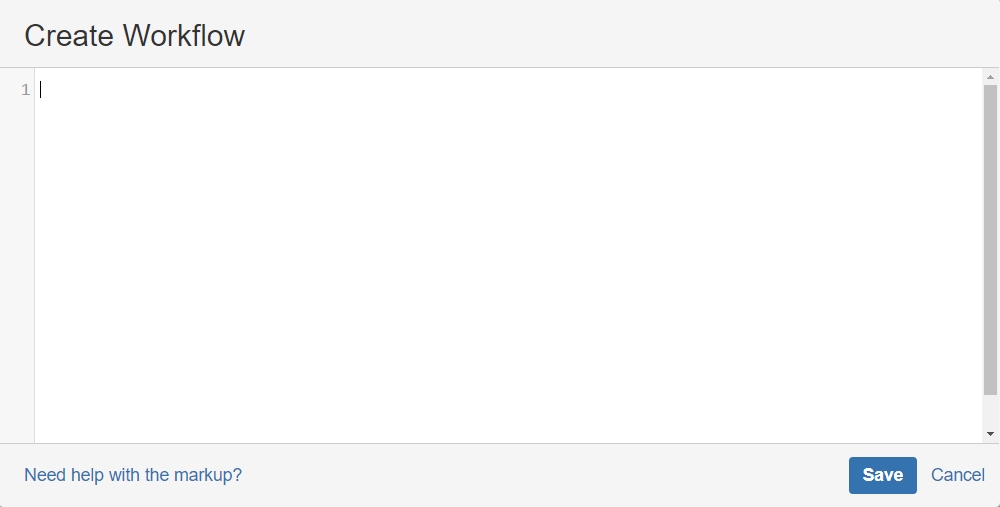

# How to copy the workflows
- Navigate to Global Workflow Templates from General configuration
- click on workflow option under workflows menu
    
- Click on Create Workflow
  
- Paste the workflow copied from CPS
  
- Verify Worflow by clicking “View” and make sure it is same as in CPS.
