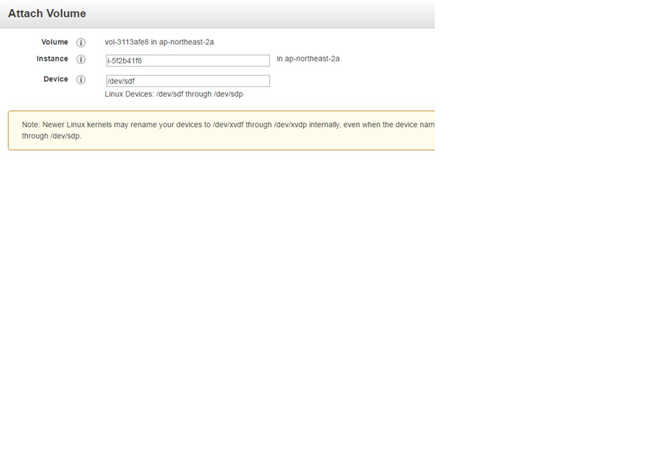
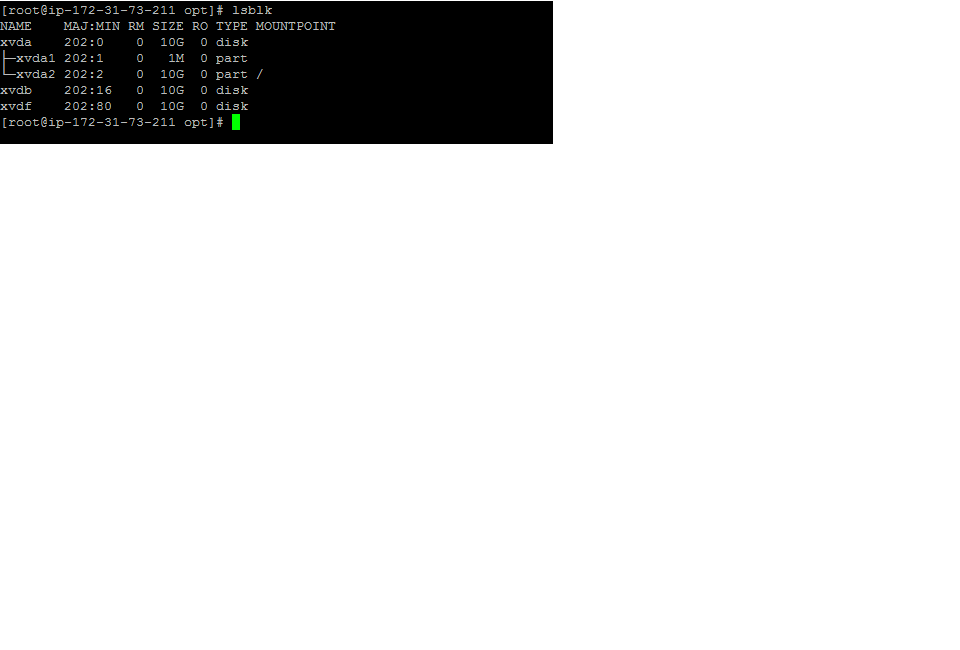
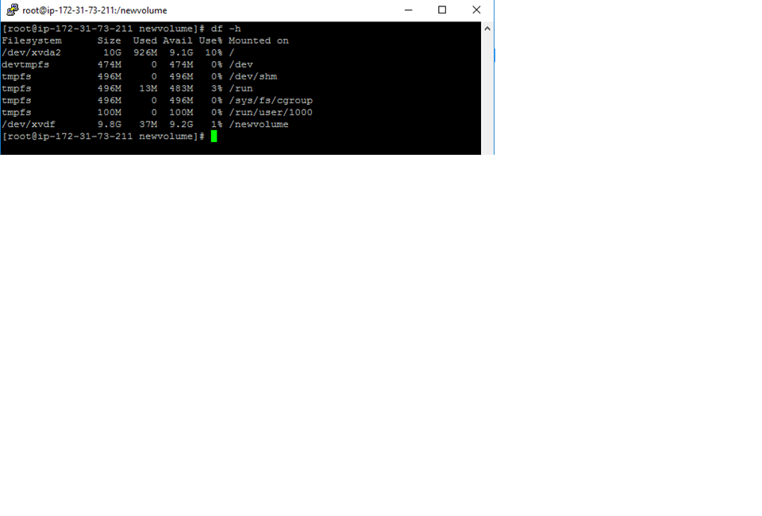

# How To Attach And Mount An EBS Volume To EC2 Linux Instance
* Head over to EC2 –> Volumes and create a new volume of your preferred size and type. 
* Select the created volume, right click and select the “attach volume” option. 
* Select the instance from the instance text box as shown below 
*  
* login to your ec2 instance and list the available disks using the following command. 
* lsblk  
* The above command will list the disk you attached to your instance. 
*   
* Check if the volume has any data using the following command.  
* sudo file -s /dev/xvdf  
* If the above command output shows “/dev/xvdf: data”, it means your volume is empty. 
* Format the volume to ext4 filesystem  using the following command.  
* sudo mkfs -t ext4 /dev/xvdf  
* Create a directory of your choice to mount our new ext4 volume. I am using the name “newvolume”  
* Mount the volume to “newvolume” directory using the following command. 
* sudo mount /dev/xvdf /newvolume/  
* cd into newvolume directory and check the disk space for confirming the volume mount.  
* cd /newvolume  
* df -h 
* The above command would show the free space in the newvolume directory. 
*   
* # EBS Automount On Reboot  
* By default on every reboot the  EBS volumes other than root volume will get unmounted. To enable automount, you need to make an entry in the /etc/fstab file. 
  * 1.	Back up the /etc/fstab file.  
      * sudo cp /etc/fstab /etc/fstab.bak  
  * 2.	Open /etc/fstab file and make an entry in the following format  
      * device_name mount_point file_system_type fs_mntops fs_freq fs_passno  
      For example, 
      /dev/xvdf       /newvolume   ext4    defaults,nofail  0 0             
      Execute the following command to check id the fstab file has any error. 
      sudo mount -a  
  * If the above command shows no error, it means your fstab entry is good.  
  * Now, on every reboot the extra EBS volumes will get mounted automatically. 
  
  
      

      
      

