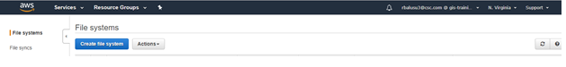
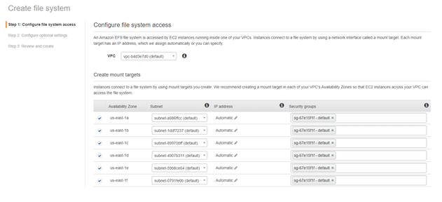
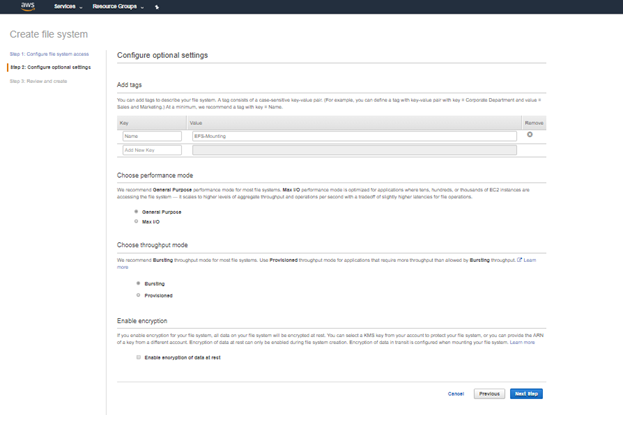
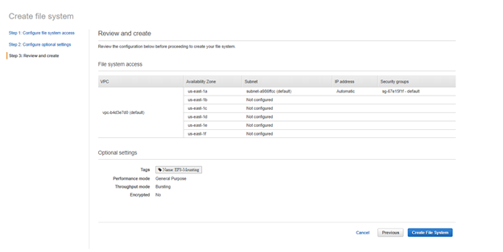
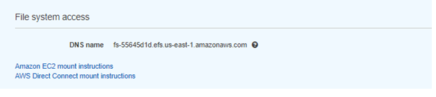
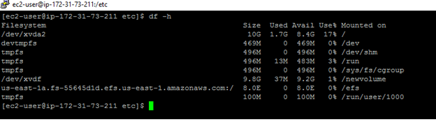

## How To Attach And Mount An EFS To EC2 Linux Instance
* 1.	Login to AWS web console  
* 2.	Select Elastic File System  
* 3.	Select Create file system  
* 4.	Select VPC  
* 5.	Select Private subnets that the EC2 Instances are on for the availability zones  
* 6.	Remove the default security group from each availability zone  
* 7.	Paste or start typing the EFS Security Group ID in for each availability zone  
* 8.	Select Next Step  
* 9.	Add Name Tag and any others  
* 10.	Select Generic or Max I/O type  
* 11.	Select Next Step  
* 12.	Select Create file system  
# How to cofigure in AWS  
* Search the EFS (managed file storage for EC2) from services  
*   
* Click on create file system from above screen  
*    
* Select the VPC and select the availability zones from the list  
*   
* Enter the value for choose the other values and click on next  
* Review the changes and click on crate file system  
*   
# Install Dependencies  
1.NFS utilities  
  a.	sudo yum -y install nfs-utils  
2.	amazon-efs-utlis  
  a.	sudo yum -y install git  
  b.	git clone https://github.com/aws/efs-utils  
  c.	Because you need the bash command make, you can install it with the following command if your operating system doesn't already have it. 
  d.	sudo yum -y install make  
  e.	After you clone the package, you can build and install amazon-efs-utils using one of the following methods, depending on the package type supported by your Linux distribution:  
  f.	RPM – This package type is supported by Amazon Linux, Red Hat Linux, CentOS, and similar. 
  g.	DEB – This package type is supported by Ubuntu, Debian, and similar. 
 
# To build and install amazon-efs-utils as an RPM package  
  1.	Open a terminal on your client and navigate to the directory that has the cloned amazon-efs-utils package from GitHub (for example "/home/centos/efs-utils"). 
  2.	If you haven't done so already, install the rpm-builder package with the following command. 
  3.	sudo yum -y install rpm-build 
  4.	Build the package with the following command. 
      sudo make rpm  
  5.	Install the amazon-efs-utils package with the following command.  
  6.	sudo yum -y install ./build/amazon-efs-utils*rpm  
# Get DNS URL  
    1.	Open EFS Web Console   
    2.	Select the newly created EFS  
    3.	Click on the DNS Names hyperlink on bottom left  
     
# Manual Mount  
 * Use the below command for manual mount. 
 * sudo mount -t nfs4 -o nfsvers=4.1,rsize=1048576,wsize=1048576,hard,timeo=600,retrans=2,noresvport fs-55645d1d.efs.us-east-1.amazonaws.com:/ efs  
 * type df -h command you can see the mount attached to efs.
 *   
# Auto mount  
 * If you reboot the system and the mount will be deleted and if the mount make available even the system reboot , we need to update the fstab file. 
 * Take the backup of fstab file (\etc\fstab)  
 * Cp fstab fstab.bak  
 * Open the fstab file add the below line and save the file  
    * mount-target-DNS:/ efs-mount-point nfs4 nfsvers=4.1,rsize=1048576,wsize=1048576,hard,timeo=600,retrans=2,_netdev,noresvport 0 0  
    * us-east-1a.fs-55645d1d.efs.us-east-1.amazonaws.com:/ /efs nfs4 nfsvers=4.1,rsize=1048576,wsize=1048576,hard,timeo=600,retrans=2 0 0  
    * Reboot the system using sudo reboot command and run the df -h command you can see the mount point and it will not be deleted.   
    *    
