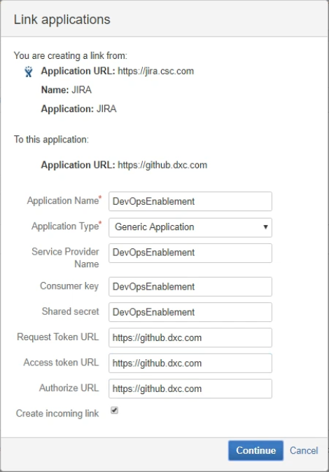
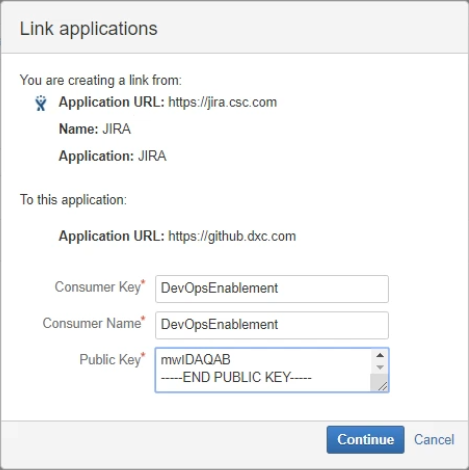
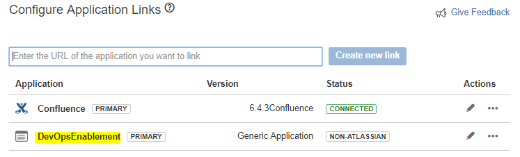
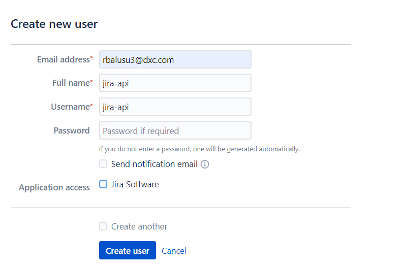
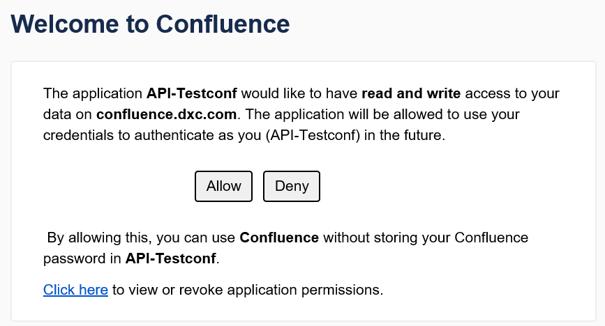
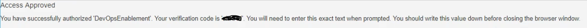

# OAuth
Authentication is a key process when integrating with Confluence. OAuth is one of a number of authentication methods used with Jira and it is typically used for server-to-server authentication, especially for behind the firewall applications.

OAuth is an authentication protocol that allows a user (that is, resource owner) to grant a third-party application (that is, consumer/client) access to their information on another site (that is, resource).  Confluence uses 3-legged OAuth (3LO), which means that the user is involved in the authentication process by authorizing access to their data on the resource (as opposed to 2-legged OAuth, where the user is not involved).  For details, please see [here](https://developer.atlassian.com/server/jira/platform/oauth/).

The following steps are derived from [here](https://developer.atlassian.com/server/jira/platform/oauth/) will show you how to generate Oauth access token to make an authenticated request to the Confluence REST API.

## Step 0. Before you begin
To complete in the below steps, you need to know and do the following:

1. A basic knowledge of how to use REST APIs, for example, requests, reponses, headers.
2. A basic understanding of Confluence.
3. If you want to run the Java example, you'll need a Maven (3.x), and a recent Java version (for example, Oracle JDK 1.8).
4. Get the sample OAuth client application code, clone it from here: https://bitbucket.org/atlassian_tutorial/atlassian-oauth-examples (in the Java directory).
5. After you have the code, build the client by running the following command in the root of the project: 

```
mvn clean compile assembly:single
```
6. Navigate to the target directory in the project and run: 
```
java -jar OAuthTutorialClient-1.0.jar requestToken
```
Ignore the exception in the output for now. You just need to do this to generate the **config.properties** file that you’ll use later.

## Step 1. Configure client application as an OAuth consumer

### **Generate an RSA public/private key pair**
1. In Terminal window, run the following openssl commands. You can do this anywhere in your file system.
```
openssl genrsa -out confluence_privatekey.pem 2048


openssl req -newkey rsa:2048 -x509 -key confluence_privatekey.pem -out confluence_publickey.cer -days 1825

    You are about to be asked to enter information that will be incorporated into your certificate request.
    What you are about to enter is what is called a Distinguished Name or a DN.
    There are quite a few fields but you can leave some blank
    For some fields there will be a default value,
    If you enter '.', the field will be left blank.
    -----
    Country Name (2 letter code) [AU]:
    State or Province Name (full name) [Some-State]:
    Locality Name (eg, city) []:
    Organization Name (eg, company) [Internet Widgits Pty Ltd]:
    Organizational Unit Name (eg, section) []:
    Common Name (e.g. server FQDN or YOUR name) []:
    Email Address []:


openssl pkcs8 -topk8 -nocrypt -in confluence_privatekey.pem -out confluence_privatekey.pcks8


openssl x509 -pubkey -noout -in confluence_publickey.cer > confluence_publickey.pem

```
This generates a 2048-bit private key, creates an X509 certificate, and extracts the private key (PKCS8 format) to the confluence\_privatekey.pcks8 file. It then extracts the public key from the certificate to the  confluence\_publickey.pem file.

2. Copy the private key from the confluence\_privatekey.pcks8 file to your clipboard.

3. Navigate to the target directory in the sample OAuth client project. Open the **config.properties** file  and make the following changes:
   - a. Paste the private key from your clipboard over the value of private_key field. Remove all line breaks.
   - b. Change the jira_home to the URL of your Jira development instance, for example, https://confluence.dxc.com
   - c. Change the consumer_key to your desired consumer key.
4. Save the **config.properties** file.

### **Configure the client app as a consumer in Confluence**
**Note:**  only  the admin can perform the following steps.
1. In confluence, click cog wheel > **General Configuration** > **Application Links**.
2. In the **Enter the URL of the application you want to link** field, enter the URL of the application for which you want to get access to Confluence (for example, https://github.dxc.com), and then click **Create new link**.  
3. **Configure Application URL** window will pop up.  You’ll see a warning message "No response was received from the URL you entered - it may not be valid. Please fix the URL below, if needed, and click Continue.".  Ignore it
4. Click on **Continue** 
5. The form **Link applications** will appear, different fields are
   - Application Name : Name of the application
   - Application Type : Select from the list
   - Service Provider Name : your Service Provider’s Name
   - Consumer key : Set your desired consumer key
   - Shared secret : Set your desired shared secret
   - Request Token URL: Set your request token URL
   - Access token URL: Set your access token URL
   - Authorize URL: Set your authorize URL
   - Make sure you select the **Create incoming link** checkbox.
  
    For example, see this 

6. On next screen of the **Link applications** dialog, enter the consumer details for the client:
   - Consumer Key : Set your desired consumer key (Note: make sure this consumer key has the same value as the consumer key in the **config.properties** file)
   - Consumer Name : Set your desired consumer name
   - Public Key = Copy the public key from the confluence\_publickey.pem file you generated previously and paste it into this field.

    For example, see this 


7. Click Continue. You should end up with an application link that looks like this example:

That’s it! You’ve now configured the client as an OAuth consumer in Jira.

## Step 2. Do the “OAuth dance”
The “OAuth dance” is a term that’s used to describe the process of getting an access token from the resource, that the consumer can use to access information on the resource. This involves a “dance” where different tokens are passed between the consumer, resource owner, and resource.  These are the roles in the OAuth authentication process, and how they relate to authenticating with Confluence:
- **Resource** : if you integrate a client application with Confluence, then Confluence is considered to be the "resource".
- **Resource owner** : as Confluence is the "resource", the Confluence user is considered to be the "resource owner" for an authentication request.
- **Consumer** : the client application is registered as a consumer, by creating an application link (that uses OAuth) in Confluence that links to the client.

Before proceeding to the steps below, create an user as **resource owner**.  This user is involved in the authentication process by authoring access to their data on the **resource**.

### How to create the resource owner
* Login to Jira as admin and create new users from user management (Admin->User management)
* click on **Create User** and create the user

* Once user is created add the user to only **confluence-oauth-api** and delete other user groups. 


1. In your Terminal, navigate to the target directory of the sample OAuth client project that you did on **Step 0**. 
2. Run the following command: 
```
java -jar OAuthTutorialClient-1.0.jar requestToken
```
This command requests an unauthorized request token from your Conflunce instance.

You’ll see the following output with the details of your new request token (due to security reason, the actual values are removed):
```
Token: <token>
Token secret: <token secret>
Retrieve request token. Go to https://<your Confluence URL>/plugins/servlet/oauth/authorize?oauth_token=<token> to authorize it.
```

The request token will persist for 10 minutes. If it expires, you’ll need to request a new one.

3. In your new private browser, login to your Confluence instance with the **Resource owner** account that you created earlier in **Step 2** and go to the URL specified in the Terminal output "https://\<your Confluence URL>/plugins/servlet/oauth/authorize?oauth_token=\<token>".  Here is an example 



4. Click Allow. This will authorize the request token.
You’ll see the following output in your browser:

Copy the verification code to your clipboard or somewhere else where you can get it.
5. In your Terminal, run the following command:
```
java -jar OAuthTutorialClient-1.0.jar accessToken <verification code>
```
You’ll need to replace the \<verification code> with your own verification code from the previous step.

You’ll see the following output in your terminal (Note: due to security reason, access token is replaced with \<access token>):
```
Access Token:  <access token>
```
Note that to get the access token in OAuth, you need to pass the consumer key, request token, verification code, and private key. However, in the client, information like the consumer key, request token, private key, and so on, are stored in the **config.properties** file when they are generated.

We now have what we wanted from the OAuth dance: an access token that we can use to make an authenticated request to the Confluence REST API. 

## Step 3. Make an authenticated request to the Confluence REST API
An access code is all that we need to make an authenticated request to the Confluence REST API. Requests are made as the **Resource owner** user that you created earlier in **Step 2** who authorized the initial request token. The access token will persist for 5 years, unless it is revoked. 

Here’s an example of a request to GET an issue, using the sample OAuth client. The following command gets the DOE-583 issue via the Confluence REST API:
```
java -jar OAuthTutorialClient-1.0.jar request https://jira.csc.com/rest/api/latest/issue/DOE-583
```
The above method returns an issue like this:
```
{
  "expand": "renderedFields,names,schema,operations,editmeta,changelog,versionedRepresentations",
  "self": "https://jira.csc.com/rest/api/latest/issue/508568",
  "id": "508568",
  "fields": {
    "customfield_13100": null,
    "customfield_13101": null,
    "customfield_13104": null,
    "resolution": null,
    "customfield_13103": null,
    "customfield_13106": null,
    "customfield_10510": null,
    "customfield_13105": null,
    "customfield_10503": null,
    "customfield_10504": null,
    "customfield_10505": null,
    "customfield_10506": null,
    "customfield_10507": null,
    "customfield_10508": null,
    "customfield_10509": null,
    "lastViewed": null,
    "customfield_12000": {
      "self": "https://jira.csc.com/rest/api/2/customFieldOption/14703",
      "id": "14703",
      "value": "Yes"
    },
    "customfield_14301": null,
    "customfield_12001": {
      "self": "https://jira.csc.com/rest/api/2/customFieldOption/14708",
      "id": "14708",
      "value": "No"
    },

    |
    V

      },
  "key": "DOE-583"
}
```
In the code, the OAuth client actually stores the access code in the **config.properties** file when it is obtained. When a request is made, the  client passes the stored access code rather than you having to enter it. 

See an example below is the content of **config.properties** file:
```
secret=<secret>
jira_home=https\://jira.csc.com
consumer_key=DevOpsEnablement
private_key=<private key>
```

That is how to use OAuth to make an authenticated request to the Jira REST API.


## Revoking OAuth access tokens
You can revoke an OAuth access token to deny a CONFLUENCE gadget access to your CONFLUENCE data. When you revoke access, the gadget can only access public data on your CONFLUENCE instance.

1. Choose your user name at top right of the screen, then choose Profile .
2. Click **Tools** > **View OAuth Access Tokens**.
3. The **Authorized Applications** page displays a list of your OAuth tokens.
4. Next to the application whose OAuth access you wish to revoke, click **Revoke Access**.
5. You may be prompted to confirm this action. If so, click OK. 
 
The gadget's access token is revoked and the CONFLUENCE gadget can only access public CONFLUENCE data.
