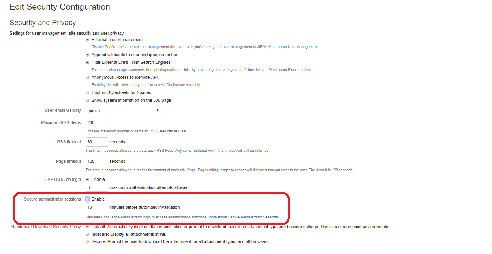

# Disable the Secure administrator sessions in Confluence
## Overview - How to disable the password prompt page for space admins in order to access their admin pages
- DevCloud confluence is integrated with SAML , for any DXC user login to confluence ,they should use their DXC global pass and login into confluence
- when the space admin accessing admin pages, system prompting the password for accessing the pages. since we are not storing the user password in Database, space admins could not able to access confluence admin pages and they are requesting the DevCloud support for generating of the password.
- Prompting the password in confluence is configurable, since it is enabled in confluence and system asking the password.
- After discussing with scrum master & product owner and we are decided to disable the password prompt option through Secure administrator sessions in confluence.
### How to disable Secure administrator sessions
- Login to confluence as Sys admin and click in General configuration and select the security configuration under "Users & Security" Tab
- Edit the security configuration and un-check the Secure administrator sessions and save it.
  
- once Secure administrator sessions disabled , space admin directly go to their admin pages without any additional authentication.
- DevCloud support team will closely monitor the space admin pages and changes made by space admins
- To achieve above , Support team will create Cron job and schedule for every day. The Job will send the email to DevCloud support for the changes made by space admins.
