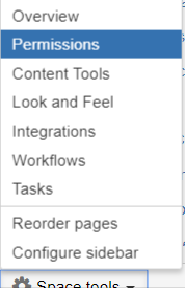

# Confluence Operations Manual

Table of Contents

* [Overview](#overview)
* [OUCH - Outage Update Checklist for Happiness](#ouch---outage-update-checklist-for-happiness)
* [Vendor Support](#vendor-support)
* [Security and Access Control](#security-and-access-control)
* [Monitoring and Alerting](#monitoring-and-alerting)
* [Operational Tasks](#operational-tasks)
* [Failure and Recovery](#failure-and-recovery)
* [Maintenance Tasks](#maintenance-tasks)
* [Backup and Restore](#backup-and-restore)
* [Contact Details](#contact-details)
* [Onboarding Access](#onboarding-access)

## Overview
- This document should be used to capture application-specific information, operational procedures etc. It should continue to be updated throughout delivery as the environment and support processes mature.
- DXC Confluence is deployed in AWS with load balancing, EBS and EFS capabilities.
    ** Application URL : https://confluence.csc.com**
- Below is Architecture diagram of Confluence 
   
 - Below is the complete description of each layer of Architecture 
    * **Amazon VPC:** AWS Virtual Private Cloud configured with public and private. An Internet gateway to provide access to the Internet
    * **Private subnet:**  In the private subnets, Amazon Relational Database Service (Amazon RDS) MySQL as the database for JIRA and Confluence.
    * **User Access:** Integrated with DXC global pass. https –443 port open to Internet for user access. All other port traffic denied
   Jump servers RDP port 3389 open to internet for administrator access. Port 22 ( SSH ) open to only Application Server Admins
   from Jump server.
    * No access to AWS EC2 Instances, backend shared storage and data bases directly. 
    * **Load balancers:** Elastic Load Balancer (ELB) to distributes requests from users to the cluster nodes.
   * If a cluster node goes down, the load balancer immediately detects the failure and automatically directs requests to the other nodes
    * **Jump Server:** Administrator access using RDP. Once Remote connectivity established then allowing to use SSH to logging Jira and confluence nodes.
    * **Database servers:** The database hosted on AWS RDS for MySQL Server. There is a master & a stand by replica with support for multiple availability zones. 
   database instances placed in private subnets not public access.
    * **Amazon EFS:** EFS provides scalable file storage for use with Amazon EC2 instances.
    * **Amazon SES:** Simple Email Service is a cloud-based email sending service to enable JIRA and Confluence to send           notifications
    * **Backup:** Automating Server Instance snapshot Backups using AWS Lambda and Cloud watch. Lambda function to take snapshots of all the EBS volumes attached to the instance tagged for Backup. Setup 7 days retention period after 7 days the old snapshot deleted automatically.

### Environment Details 
| Application                                      | Environment | IP Address    |Application URL   | AWS URL                                                                   |
|--------------------------------------------------|-------------|----------------|-------------------------------------------------------------------------|--------------------|
| Confluence -Node1    | Production        | 52.73.177.83   | https://confluence.csc.com/|https://035015258033.signin.aws.amazon.com/console|
| Confluence-Node2     | Production        | 35.153.252.171| https://confluence.csc.com/|https://035015258033.signin.aws.amazon.com/console
| Confluence-Pentest   | PenTest           |52.73.186.115  | https://confluencepentest.dxcdevcloud.net/|https://gis-training.signin.aws.amazon.com/console|
| jumpserver-win2016-jira-confluence   | Production           |54.84.37.216  | https://035015258033.signin.aws.amazon.com/console |

| Database                                      | Environment | DB Endpoint URL | AWS URL                                              |
|--------------------------------------------------|-------------|----------------|-------------------------------------------------------------------------|
| MYSQL    | Production      |cz-mysqldb.cb53usaz5oke.us-east-1.rds.amazonaws.com | https://035015258033.signin.aws.amazon.com/console|
| MYSQL    | Pen Test        |pentest-confluence-20180701.ceu54difvuaw.us-east-1.rds.amazonaws.com:3306 | https://gis-training.signin.aws.amazon.com/console|
### Load Balancer  Details 
| Name                                      | Value |
|--------------------------------------------------|-------------|
| Load Balancer Name    | confluence-applicationLB        |
| DNS Name    | confluence-applicationLB-1817892664.us-east-1.elb.amazonaws.com        |
| VPC ID    | vpc-5b49163f|
| Availability Zones    | us-east-1a,us-east-1c        |
| Load Balancer Type    | Classic        |

## OUCH - Outage Update Checklist for Happiness
- If the users are not able to access confluence.csc.com due to the server or database not responding, this is considered as an outage.
- Publish the information in DXC Facebook i.e https://dxc.facebook.com/groups/212949325934065/ and keep updating the status on regular intervals.
- If the application is not coming up after troubleshooting, immediately raise a critical/high priority ticket with Atlassian support and below is the link for raising the ticket 
- https://support.atlassian.com/contact/#/ 
- Fill the information and submit the request 
The details about various communication channels are available in [Communication Plan](https://github.dxc.com/pages/Platform-dxc/docs/posts/devops-communication-plan/).
## Vendor Support

Vendor support is provided by Atlassian, though the same support channels as Confluence.  We have a Support Entitlement Number SEN-6941251

Associated with this number are separate technical contacts and billing contacts.  Amanda Noble is the primary for both.

You must first register for a support account, and then request one of the existing contacts to add your account as an additional contact, which they can do at this page: https://my.atlassian.com/product

To contact the vendor directly for high-priority issues, use this link:  https://my.atlassian.com/products/requestsupport/6941251.  It includes our license ID, and will take you directly to a page to open a support request.

## Security and Access Control

Confluence uses Atlassian Crowd, which is a centralized single sign-on provider that is actually hosted by our [JIRA instance](https://github.dxc.com/platform-dxc/jira/). In effect, configuring JIRA for single sign-on, and then Confluence with Crowd pointing to JIRA, means Confluence users can use DXC GlobalPass.

In addition, we also support external user access control provided Account Manager/Project Manager accepts the Risk 

In addition, Confluence uses the same internal user directly as JIRA, however has its own set of database tables.

Only DevCloud support have Administrative access to the application, using admin access, support users can onboard the users and granting the space permissions.

Confluence server login through public & private key authentication. Support created the jump server , the support people login to production server from jump server for upgrades and start/stop the confluence services

## Monitoring and Alerting
We have a Grafana dashboard that displays certain monitoring metrics for confluence here:
[https://dataviz.platformdxc-sb.com/grafana/dashboard/db/21-confluence](https://dataviz.platformdxc-sb.com/grafana/dashboard/db/21-confluence?refresh=10s&orgId=1).

### System Up/Down Monitoring

We have a Lambda function that runs once every minute to check the JIRA URL. It reports status into a CloudWatch Alarm, which is defined to alert if the site is down for 5 minutes and will send an SMS notification to a subset of admins.

### License Monitoring

We have a Lambda function that runs on a schedule (3 hours) to review the license usage. These details are then posted to CloudWatch, and visible in the Grafana dashboard. There is no threshold definition nor alerting for this at the moment.

### Enhanced AWS EC2 Metrics

We have turned on enhanced EC2 metrics to collect in-guest elements such as memory. These are visible on the Grafana dashboard or in CloudWatch.

## Operational Tasks

Most of the tasks related to onboarding users, space creation, migration of the spaces
onboarding the users can be done throgh Jira and once the users onboarded they will be added to confluence-user group.
#### Space Creation & granting the permission 
- Only sys admins can create the space
- Login as sys admin and create the space and provide the access to required users.
- From Space tab , select the create space and 
-  
- Select the blank space and click on Next
- Enter the space namd and Space key and cick on create and space will be created
- 
- once space has been created , grant the permissions from space tools
 - 
- Add the groups or users to space permissons to space and save it.
#### Migration of spaces 
- The requester should export the space as XML.zip and share the same zip file to devcloud support
- DevCloud support team login to confluence as Sys admin and export the space into confluence
- Select the General configuration from admin tab and select  the "Backup & Restore" from left hand menu
- if the space size is small directly upload the xml.zip from local system using Upload and restore a site/space backup and if the space size big (>10 MB), copy the file into /efs/confluence-shared-home/restore in confluence server and upload using Restore a backup from the Confluence Home Directory
 
- Check the Index Tab for both the options
## Failure and Recovery
- All confluence servers are configured in AWS 
- Confluence servers are deployed on Load balancers
- If the application is not responding and if the monitoring is in places we will come to know what would be root cause. If we need to restart the server and below is the process.
- Login to Confluence server as super user
- go to /opt/atlassian/confluence/bin directory
- use this command for stopping the server - ./stop-confluence.sh
- use this command for starting the server - ./start-confluence.sh
### How to Stop and start the server from AWS console
- Login to AWS using this URL -> https://035015258033.signin.aws.amazon.com/console
- Once login click on EC2 instances
- Search for confluence
- Select running confluence instance state and right click and select the stop/start from Instant state.
- Only stop one instance at a time and please do not stop both instance or this will lead to an outage.
- Once confluence is up, login into confluence and validate
## Symantec SSL certificates renewals
 - Please click [here](https://github.dxc.com/Platform-DXC/JIRA/blob/DOE-1014/docs/SSL/SSL%20Configure.MD) and it will gives the     complete details i.e how to procure and configure the SSL certificates for confluence web server.
 ## Maintenance Tasks
Atlassian releases confluence versions regularly
- Below is the procedure for upgrading the confluence to latest version
  https://github.dxc.com/Platform-DXC/confluence/tree/master/docs/upgrade/confluence-6.4.3
  
### Maintenance Timing

Our lowest volume period is always Monday-Friday between [22:00 UTC](https://time.is/compare/2200_10_Oct_2018_in_UTC) and [02:00 UTC](https://time.is/compare/0200_11_Oct_2018_in_UTC). As a result, most small maintenance should be performed between those hours if done during the week, while week-ends are extremely low during the entire period and should be used for large scale/impacting changes.  
  
## Backup and Restore

### Backup
- We configured the daily backups through Snapshots for confluence servers.
- confluence backup will be triggered through Lambda function and it was written in Python and which is scheduled everyday 12 AM midnight.
  
- The function is scheduled through cloud watcher and event name is "Confluence_Node_EBS_Snapshots_by_Lambda"
  
- Click on cloud watcher from Lambda Dashboard and create a rule and schedule the function
- Cron expression  `cron(0 1/12 ? * * *)` means that the job is scheduled every day at 12 AM midnight

## Escalations & Contact Details  

Confluence does not have a Platform DXC ServiceNow incident queue for reporting or managing issues. Escalations can be managed through JIRA as open issues to CSZD or through the DevOps Enablement MS Teams "Confluence" channel

Below are contact details of the SPOC

| Name                                      | Email                  | contact No     | Time Zone
|-------------------------------------------|------------------------|----------------|----------
| Jay Shain                                 | jshain@dxc.com         | +001           | PST
| Nguyen, Tien Van                          | tien.nguyen3@dxc.com   |+001            | PST
| Ravi Sankar                               | rbalusu3@dxc.com       |+91-9916885645  | IST
| Adam Harvey                               | adam.harvey@dxc.com    | +001           | EST
| Linda Hansen                              | linda.hansen@dxc.com   | +001           | PST

If you have any clarifications please send a mail to devcloud_Support@csc.com

## Onboarding Access
* If any of the project wants to use the confluence.csc.com and they need to send a mail to devcloud-support@csc.com for onboarding 
* DevCloud support will send the onboarding template and the project manager will fill the template and send back to devcloud support
* support will create users in Jira and groups and the users to confluence-user group
* Onboarding template is available in See [Onboarding Template](https://github.dxc.com/Platform-DXC/JIRA/blob/master/docs/Onboarding_Request_Template..xlsx) 
* All DXC internal users should login with DXC global pass and external users should login with user id & password 
* External users will be onboarded into the confluence user database system (managed in the JIRA/Crowd app) provided they agree the risk acceptance  & provide the business justification
* Below is the risk acceptance for external users 
    **I, (insert name), accept the risk of providing external access to the Jira project (insert project name) and will promptly inform the devcloud team if and when some or all of the external users no longer need access.**
* DevCloud support team will create a request in CZSD Project(https://jira.csc.com/secure/RapidBoard.jspa?rapidView=1829&projectKey=CZSD&view=planning) with label as "external-users" and update the risk acceptance against the ticket

