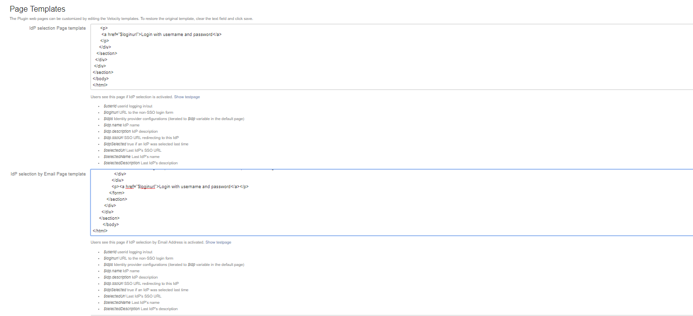

# How to configure the SAML Vendor plugin version 0.14.7
## Installing SAML vendor single-sign on plugin
* Download the samlsso-confluence-0.14.7.jar & samlSingleSignOn-confluence.xml into your local directory  
* The above 2 files are available in /SAML-Restore folder
* Login to confluence  
* Select the add-ons from confluence adminstartion menu  
* select the Uplpad App link and click on Choose file and select the samlsso-confluence-0.14.7.jar from your local directory  
* The screen shot is available in   
* The installation will take 2 to 3 min and once done The **_"SAML SingleSignOn for Confluence"** will appear in the add-ons list
* Expand the plugin and check the installed plugin version is 0.14.7
* click on License Key and add the below license key and update (The licenes key automatically applied when you install the jar file and of if you not see the license key , copy the below licene key and apply 
/***<table><b>License Key</b><tr><th>AAABag0ODAoPeNqVkV9rwjAUxd/zKQJ70QdLWzc3hcKk9mFg7VjdnvZyjbc1kKblJpH57ZdWZX/eD
ISQe5Nfzjm52x4cz4F4HPMoXISPi3jO09WWx2H0xDau2SEV1btBMkkU+sFWaATJzspWJ+UyX/NS6
lqhX2rNC81HZVmMedUST1tdKYda4P/tqEQ6Io35gOQD/nPhTzQNkpCg+FoK1AZZSgj9UyuwmPSaJ
uF0Ek+Zh1kQdgMNJssG9B74pt0pvDayHKRKQPe1Z2FEINqGZUdQbsAlFShP98WA0LTK9cUArALTK
VdLbQIDjTKmDX5kB54rj5hYcsjUWeCHV97z4ltZpQWySBchXq22qMF3sq9O0unqd977jWasoBq0N
GfxPqfO+cu8FLKHGZ8cdS0NXVZmm8TPyWx+H8UPU3aJ8hfXaSUbaXF/7W1PHQ5RpkWeZ2/py3J9q
x/0+qkjaS75vDoSBzD45+O8kW+SRNp1MCwCFFONtC6vqVtoCtn+qGozdh1k0od/AhRfoS0Phs0BS
0MkwHuCQ7eBb+8j2Q==X02hp</th></tr></table> ***/ 
* After installing the plugin and expand the plugin and select the configure   
## SAML Identity Provider Settings
* Goto to bottom of the page and select the Import XML button and select the **"samlSingleSignOn-confluence.xml"** from your local directory and click on ok and after importing the check whether the below values are appearing in the configuration  
* Please check    
<table><tr><th>Name</th><th>DXCGLOBALPASS</th></tr>
    <tr><th>Description</th><th>DXCGLOBALPASS</th></tr>
    <tr><th>IdP POST Binding URL</th><th>https://gpl.amer.csc.com/affwebservices/public/saml2sso</th></tr>
     <tr><th>IdP Token Signing Certificate</th><th>-----BEGIN CERTIFICATE-----
MIIGBzCCA++gAwIBAgICAOMwDQYJKoZIhvcNAQEFBQAwgYUxCzAJBgNVBAYTAlVTMREwDwYDVQQI
DAhEZWxhd2FyZTEPMA0GA1UEBwwGTmV3YXJrMQwwCgYDVQQKDANDU0MxJzAlBgNVBAsMHklkZW50
aXR5IGFuZCBBY2Nlc3MgTWFuYWdlbWVudDEbMBkGA1UEAwwSQ1NDIEdsb2JhbCBQYXNzIENBMB4X
DTE0MDEyNDAyMjgwMloXDTE5MDEyNDAyMjgwMlowgY0xCzAJBgNVBAYTAlVTMREwDwYDVQQIDAhE
ZWxhd2FyZTEPMA0GA1UEBwwGTmV3YXJrMQwwCgYDVQQKDANDU0MxJzAlBgNVBAsMHklkZW50aXR5
IGFuZCBBY2Nlc3MgTWFuYWdlbWVudDEjMCEGA1UEAwwaQ1NDIEdsb2JhbCBQYXNzIEZlZGVyYXRp
b24wggEiMA0GCSqGSIb3DQEBAQUAA4IBDwAwggEKAoIBAQC2OUQJxJUBle4/9TXVUKtBD5/lxplh
2Tjmgrga3wqFfMOXQhgcP02DI6LHBEUhUNL1l+0ozBgPioUUVizpkCfgp1oVONIPfbAkNrFj93DG
XDeEYxGYcV1bhWgzFhdkR2eUYOO58LSbjas5QYAjD6ODOnj8kqKlTkNsU4iDjwR27r0XcfiENHSU
JJJzyYXmf3grBzwOF79WEnGchUC3CVFUIVZPnj1v/uT+Zrc2U6/DvkGeVPSRKhDVroPfEeZWMzUF
JoZeeKoHSo/qxxQGVgBAOl/2x8Xolrqhn3Kb7T0Ab5i4E1a9nn7jbk06m8wnHnj7ry/JA/W/pQOX
1T9RUX6dAgMBAAGjggF1MIIBcTAJBgNVHRMEAjAAMAsGA1UdDwQEAwIFoDA8BgNVHR8ENTAzMDGg
L6AthitodHRwczovL2dwLmFtZXIuY3NjLmNvbS9DU0NHbG9iYWxQYXNzQ0EuY3JsMBMGA1UdJQQM
MAoGCCsGAQUFBwMDMB0GA1UdDgQWBBTOC3FmkgXi31DlXQ+Cjod5nvJFDjCBugYDVR0jBIGyMIGv
gBSToByToAOcFxr+W+MPOaoosF1aX6GBi6SBiDCBhTELMAkGA1UEBhMCVVMxETAPBgNVBAgMCERl
bGF3YXJlMQ8wDQYDVQQHDAZOZXdhcmsxDDAKBgNVBAoMA0NTQzEnMCUGA1UECwweSWRlbnRpdHkg
YW5kIEFjY2VzcyBNYW5hZ2VtZW50MRswGQYDVQQDDBJDU0MgR2xvYmFsIFBhc3MgQ0GCCQD5XfYk
khU/ADAoBglghkgBhvhCAQ0EGxYZU1NMIEdlbmVyYXRlZCBDZXJ0aWZpY2F0ZTANBgkqhkiG9w0B
AQUFAAOCAgEAeS6l7a0mVxmGw4wtm6EnVD+7pdGx0t/a738wbuP9AcFmD0d3U6DahweWOpfVnYS9
0TR8iKk3dRmbUb88bP/Udtybq6CAV7NrTr3wWfDCbh7jfzSqQuFYwrCHC0JHYAAAjk/4Cq6aIvy2
UomYI7p4Ldvh/3KPvvDhW5mkmtaVqmmHuQVXtc2PDqHr4Y5gl5jITac5O/AkMYDpbmX8QgJrsd53
448EB8EK+KXiwqR3DAEP8cAEur+9mX6pgmfYIaGl+/AciYmhCF4fdRJVHUz88/JojZjS7AkdsPvP
7iPL3nYQqw4dTTocfLO664ik4AT9efVmP8OdOJecBj7dhFc6Pz1Rzk8HBsWY+rpmJV+Tc7I8d8aW
Ny9gNaFEczYCBtNScQP0NxfIynx8SClR6KbgHH3mVcrwQOobg8oU8tvqN58FIpLIohqWcqY5H/un
/7KyEUv/CiowDqx0MFRxkKpZAe4eGcvgwdDegKAncOMbYNn4OhTuTx6a1EACei1aeLqP8cW4ebpw
EQmn71pmcp09mnC6tKM9ABqZRoOR6NpSKGn08oT9z/prM3vaQjAFVCyqyk3qf8xpe1qLjzmaBxvS
ejRD6ys/weJU8A4va8Y/GwMHRGEZ6E6BW46WC+vG7WasmoaXQV4f7I/tDEXy8oNq0QGH2fr3lHsY
/35sZWInV24=
-----END CERTIFICATE-----</th></tr>
 <tr><th>Enable SSO Redirect</th><th>Should be checked</th></tr></table> 
## Page Templates confguration  
* click in show Page Template Settings and configure the below values  
* Screen shot is available in     
* Screen shot is available in     
  <table><tr><th>IdP selection Page template</th><th><html>
 <head>
  <title>Select Identity Provider</title>
  $webResourceManager.requireResource("$pluginproperties.pluginkey:resources")
  <meta name="decorator" content="atl.general">
 </head>
 <body class="aui-layout aui-theme-default page-type-message" >
  <section id="content" role="main">
   

    <section class="aui-page-panel-content">
     

     <h1>What kind of user are you?</h1>
     #if($idpSelected)
      
Select or wait 3 seconds to use $selectedName 

        
      #end
      #foreach($idp in $idps)
      

        <a href="$idp.ssoUrl">$idp.name</a> $idp.description
      

      #end
      

       <a href="$loginurl">Login with username and password</a>
      

     

   </section>
  

 

</section>
</body>
</html> </th></tr>
<tr><th>IdP selection by Email Page template</th><th>#disable_html_escaping()
<html>
  <head>
  <title>Enter your Email Address</title> 
  $webResourceManager.requireResource("$pluginproperties.pluginkey:idpByEmailResources")
  <meta name="decorator" content="atl.general">
	
	</head>
	<body class="aui-layout aui-theme-default page-type-message">
	  <section id="content" role="main"> 
	    

         

           <section class="aui-page-panel-content">
             <h1>Single Sign On</h1>
             <form class="aui top-label" id="emailAddressForm" >
               

                 <label for="emailAddressField">Enter your email address</label>
                 <input type="text" class="text" id="emailAddressField" name="emailAddressField">
                 

                   
No SSO destination found for this address

                   
Redirecting...

                 

               

               
<a href="$loginurl">Login with username and password</a>

             </form>
           </section> 
         

       

     </section>
	</body>
</html> </th></tr>
<tr><th>Error Page template </th><th><html>
 <head>
  <title>SAML Single Sign On failed</title>
  $webResourceManager.requireResource("$pluginproperties.pluginkey:resources")
  <meta name="decorator" content="atl.general">
 </head>
  <body class="aui-page-focused aui-page-medium" >
   

    

     <section class="aui-page-panel-content">
      <h1>SAML Single Sign On failed</h1>
      
Please contact your administrator or log in at the <a href="$loginurl">login page</a>.

      #if($userid)
       
$userid could not be authorized. This userid is unknown or the user does not have sufficient permissions.

      #end
      #if($message)
       
$message

      #end
      #if($stacktrace)
      <a id="show-stacktrace-trigger" data-replace-text="Hide Stack Trace" class="aui-expander-trigger button" aria-controls="stacktrace">Show Stack Trace</a>
      
$stacktrace

      #end
     </section>
    

   

 </body>
</html></th> </tr>
<tr><th>Logged out Page template </th><th><html>
 <head>
  <title>You are logged out now</title>
  $webResourceManager.requireResource("$pluginproperties.pluginkey:resources")
  <meta name="decorator" content="atl.general">
 </head>
 <body class="aui-layout aui-theme-default page-type-message" >
  <section id="content" role="main">
   

    <section class="aui-page-panel-content">
     

     

      <strong>You are logged out now</strong>

      

       <a href="$loginurl">Login again with username and password</a>
      

      

       <a href="$ssourl">Login again with Single Sign On</a>  
      

     

    

   </section>
  

 

</section>
</body>
</html> </th></tr> </table>

