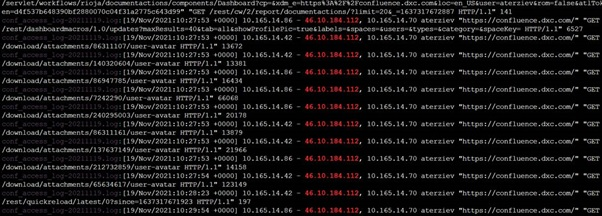

## Recent vulnerabilities in the confluence software suite and reported by Security Incident Response Control Center (SIRCC)

This page documents the Access log enabled to get the security logs for confluence application requested by DFI Hunt Team - Forensic investigation and 
got implemented the X-forwarded script in both nodes on 25 October 2021

## Description

DFI Hunt Team requested us to provide the access log details for confluence application and they wanted to verify the access logs in order to observer 
what data is being logged. Those systems contain DXC confidential data and should not be left exposed to internet.

As per their requisition, we enabled the Access log option in both nodes in confluence on 25 October 2021. The webserver access logs will be stored in 
Atlassian_confluence.logs only.

Generated the access logs in both nodes of confluence server and shared the logs as a zip format to the team for review their point of security cases.

The matter of securing our Confluence server’s privacy is of paramount importance, where they wish to avoid seeing sensitive information leaked in the 
DarkWeb or worse – public media! So, they requested us again to provide us the access logs with client IP details.

In order to get the client ip details, we implemented the below script in both nodes of confluence server.

```
<Valve className="org.apache.catalina.valves.RemoteIpValve"
internalProxies="10\.165\.14\.85" remoteIpHeader="x-forwarded-for"
proxiesHeader="x-forwarded-by" protocolHeader="x-forwarded-proto"/>

<Valve className="org.apache.catalina.valves.AccessLogValve"
directory="logs" prefix="conf_access_log"
fileDateFormat="-yyyyMMdd" suffix=".log"
pattern="%t %a %l %{X-Forwarded-For}i %{X-AUSERNAME}o &quot;%{Referer}i&quot; &quot;%r&quot; %b" resolveHosts="false"/>
```

While logging the external IP address into confluence server, the same details were also automatically logged in the reverse proxy server.

Below are the reference screenshot for one of the user client ip logs details information



