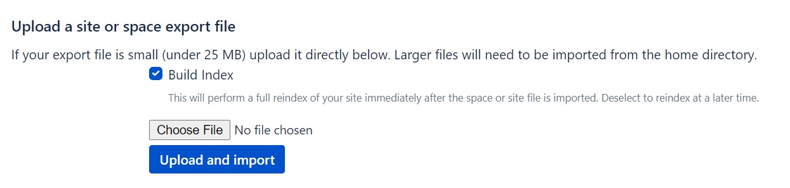
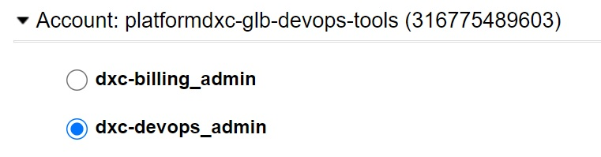
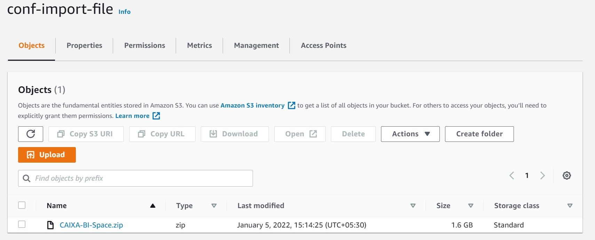
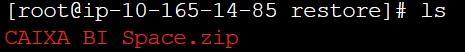
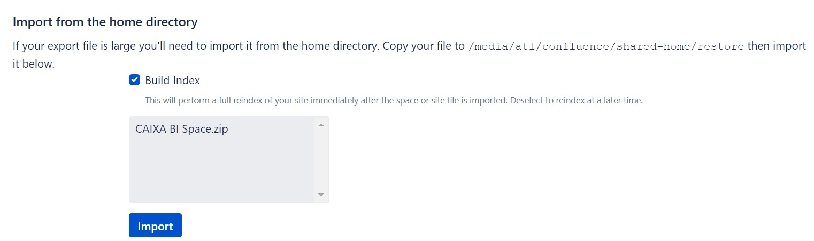

# Confluence Space Migration procedure and steps

This document describes the space migration method. Now a days We are getting user request to import their space into our confluence instance

Whenever we receive the space migration request, we need to verify the file size and that extension should be in zip format

There are two ways to import the space based on the file size. We need to follow the below steps to import their space into our instance

### If the file size below 200mbs, please follow the below steps to import the space

1.	Go to confluence link - https://confluence.dxc.com/
2.	Choose “General Configuration” option under “Space administrator”
3.	Select “Backup & Restore” option under “Administration” section
4.	There is a section called “Upload a site or space export file”. Please choose and upload your zip file which is below 200mbs in size. It will accept if the file size is small.



5.	We will do content re-index once done the import action. It will take time to complete full reindex the content.

### If the file size above 200mbs, please follow the below steps to import the space

1.	Please login into the AWS console for confluence production account - Account: platformdxc-glb-devops-tools (316775489603)



2.	Select S3 bucket – We created a s3 bucket named - conf-import-file
3.	Please choose that bucket and upload the space zip file into that bucket



4.	While uploading, please don`t select versioning and any other option. 
5.	Once uploaded file into bucket, go to EC2 instance and select confluence any one node instance and connect thru Session Manager and please follow the below commands 
    to go inside the copy the file from s3 bucket to EC2 confluence instance
    
6.	Copy the file to the confluence Home directory by following the below steps

````
# sudo su
# cd /media/atl/confluence/shared-home/restore
# aws s3 cp s3://<bucket name>/<filename with ext> filename with extension like below
# aws s3 cp s3://conf-import-file/CAIXA BI Space.zip CAIXA BI Space.zip
# ls – Showing copied file in the same directory


````

7.	Once copied, please verify the file in the “Import from the home directory” section in confluence as below



8.	Select the copied file there and then import. Please uncheck the “Build Index” option as of now
9.	If the file is imported successfully into confluence, please verify the confluence imported space

**Note:** Sometime upto 500mbs file working if you follow the first step. If not working, please choose the second step to proceed.
