# Confluence Outage Retrospective from 16 April 2019

This page documents the retrospective for the confluence.csc.com outage that occurred on April 16 and 17, 2019.

## Summary

An outage impacting 4000 DXC employees lasting 24 hours affected the DXC Confluence system on April 16 and 17 2019.

## Root Cause

The DXC Confluence servers were infected by a coin mining malware infection based on a known security vulnerability reported within the last 30 days discovered by the vendor.  It used two Confluence plugins to gain access to the system to perform remote code execution and install itself.  It began immediately consuming 100% CPU on all Confluence nodes in both Production and PenTest.

## Resolution

Due to the initial unknown nature of the malware exploit and initial triage both by the OE&E DevOps Enablement team and the DXC Digital Forensics Investigation team, the group decided to shut the Confluence service down to contain the exploit.  Per vendor recommendation, the two compromised plugins (WebDAV, Widget Connector) which were affected by the vulnerability were disabled in the tool, and a pair of clean AWS EC2 instance were rebuilt. Once complete, and initial investigation of the malware was performed, the service was returned.

## Event Table

* 2019-04-13 20:33 UTC - First mobile phone alert received by Confluence team, indicating service unavailable. This is the first time the system actually crashed and restarted itself.
* 2019-04-16 15:18 UTC - Second mobile phone alert for another outage, indicating a repeat service unavailable. System crashed again, and restarted itself.
* 2019-04-16 20:01 UTC - Confluence applications links removed in jira.csc.com
* 2019-04-16 20:11 UTC - 2 new EC2 instances created with same sizing for PRO, previous version was RHEL 7.5, but it's not available anymore in AWS, the only available was RHEL 7.6 (HVM) 64-bit x86
* 2019-04-16 20:45 UTC - sg group (sg_safe_confluence) created, as the current ones are shared with JIRA.
* 2019-04-16 21:15 UTC - New key pair ( doe-production ) created for recently created ec2 instances
* 2019-04-16 21:19 UTC - Set name tag to confluence-node01a-prod and confluence-node02a-prod
* 2019-04-16 21:22 UTC - Connected to the node01a via putty.
* 2019-04-16 21:25 UTC - sudo yum update
* 2019-04-16 21:29 UTC - sudo yum install -y nfs-utils
* 2019-04-16 21:30 UTC - EFS (Instructions from Amazon) Mounted
* 2019-04-16 21:32 UTC - Opt mounted
    * Dettached opt volume from old node01 and node02
    * Attached opt volume to node01a and node02a
* 2019-04-16 22:05 UTC - Pub keys copied to new nodes
* 2019-04-16 22:13 UTC - EFS and OPT remounted.
* 2019-04-16 22:26 UTC - Created confluence service and confluence user
* 2019-04-16 22:31 UTC - Java installed.
    * Changed tomcat configuration
    * Reset "admin" password in DB
    * Rest confluence base URL in DB
    * Re-ordered user directory in DB
    * Tried to access the system via ssh tunnel many different ways - no success
    * Started up Windows Jump Server
    * restricted 22 to sg_confluence_admin
    * restricted RDP port also to 192.46.0.0/16
* 2019-04-17 00:45 UTC Had success connecting 10.0.0.37:8080 (using private IP).
* 2019-04-17 01:00 UTC Started working on node 02a
    * Detached /dev/xdb and attached /dev/xdf 
    * This was the /opt node for confluence-node2
    * Now it is connected to confluence-node2a
    * Started up confluence-node2a
    * Connected with key-pair
    * Added all the team's ssh keys 
    * Jay re-connected with his key
* 2019-04-17 01:15 UTC
    * sudo yum update
    * sudo yum install -y nfs-utils
    * sudo su
    * cd /
    * mkdir efs
    * sudo mount -t nfs4 -o nfsvers=4.1,rsize=1048576,wsize=1048576,hard,timeo=600,retrans=2,noresvport fs-1688505f.efs.us-east-1.amazonaws.com:/ efs
    * lsblk
        * found xvdf.
    * mount /dev/xvdf /opt
    * adduser --create-home -c "Confluence role account" confluence
    * Startup init.d created
        * cd /etc/init.d
        * vi confluence
```bash
#!/bin/sh -e
# Confluence startup script
#chkconfig: 2345 80 05
#description: Confluence

# Define some variables
# Name of app ( JIRA, Confluence, etc )
APP=confluence
# Name of the user to run as
USER=confluence
# Location of Confluence install directory
CATALINA_HOME=/opt/atlassian/confluence

# Location of Java JDK
export JAVA_HOME=/usr/java/default

case "$1" in
  # Start command
  start)
    echo "Starting $APP"
    /bin/su -m $USER -c "$CATALINA_HOME/bin/start-confluence.sh &> /dev/null"
    ;;
  # Stop command
  stop)
    echo "Stopping $APP"
    /bin/su -m $USER -c "$CATALINA_HOME/bin/stop-confluence.sh &> /dev/null"
    echo "$APP stopped successfully"
    ;;
   # Restart command
   restart)
        $0 stop
        sleep 5
        $0 start
        ;;
  *)
    echo "Usage: /etc/init.d/$APP {start|restart|stop}"
    exit 1
    ;;
esac

exit 0
```

* 2019-04-17 01:21 UTC
    * chmod +x confluence
    * Update server.xml
        * cd /opt/atlassian/confluence/conf
        * cp server.xml server.xml.041619
        * vi server.xml 
            * change line 6
            * secure "true" to "false" 
    * change login page options
        * cd /opt/atlassian/confluence/confluence
        * make a copy of loginpageoption.vm
* change this
```html
     32  <p>
     33         <a href="https://confluence.csc.com/plugins/servlet/external-login">DXCGLOBALPASS</a> DXC GLOBAL PASS
     34 </p>
     35 <p>
     36         <a href="https://confluence.csc.com/login.action?nosso&os_destination=%2F">Login with username and password</a>
     37 </p>
```
* to this

```html
     33          <a href="/plugins/servlet/external-login">DXCGLOBALPASS</a> DXC GLOBAL PASS
     34  </p>
     35  <p>
     36          <a href="/login.action?nosso&os_destination=%2F">Login with username and password</a>
     37  </p
```

* 2019-04-17 01:35 UTC Installed JIRA on node 2a
    * as ec2-user established ssh key from node 1a to 2a
        * cp /tmp/\*.rpm from node 1a to node 2a
        * cd /tmp on node 2a
        * sudo rpm -ivh jdk-8u77-linux-x64.rpm
        * sudo su
        * service confluence start
        * cd /opt/atlassian/confluence-data/logs
        * tail -f atlassian-confluence.log
    * Confluence is ready to serve
    * All is working now 🎉

* 2019-04-17 13:00 UTC (approximate)
    * ✅Confirmed with DFI team about proceeding with re-enable Confluence service to all users.
    * ✅Confirmed plugins are disabled
        * ​​​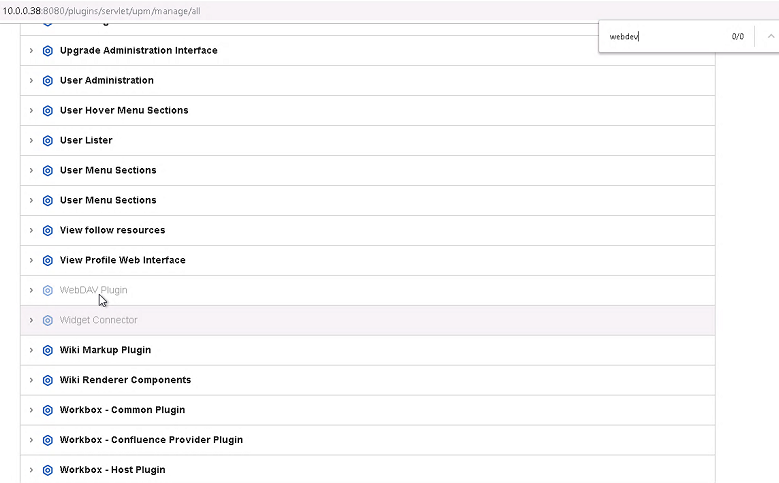
    * ✅Configured confluence app itself with new private ips/align cluster details (config file on server) /opt/atlassian/confluence-data/confluence.cfg.xml
        * 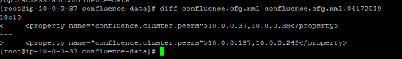
    * ✅On server.xml set secure=false (/opt/atlassian/confluence/conf/server.xml)
        * 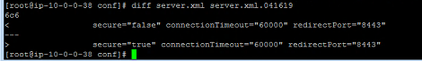
    * ✅Validated /opt/atlassian/confluence/confluence/WEB-INF/classes/seraph-config.xml
    * ✅Updated base URL in Confluence
        * From this: 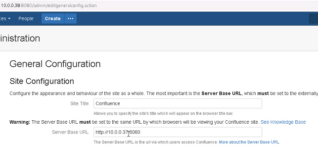
        * To this: 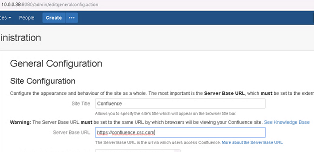
    * ✅Make sure configs align to what we have in GItHub (make sure we didn't miss anything on the servers, but hold off fixing github, jvm heap params) https://github.dxc.com/Platform-DXC/confluence/tree/master/code
    * ✅Updated /etc/fstab to make sure mount points stick
        * 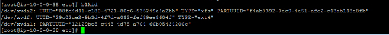
        * Backup original fstab
        * 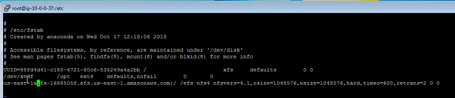
        * Server rebooted
        * Verified mount points (/opt and /efs for both nodes)
    * ✅Attached new confluence nodes to load balancer
        * ⚠️Services didn't start automatically after server rebooted (troubleshooting using this documentation: 
        * 📝 https://confluence.atlassian.com/conf64/start-confluence-automatically-on-linux-936511586.html), we missed the step *sudo chkconfig --add confluence*
            * 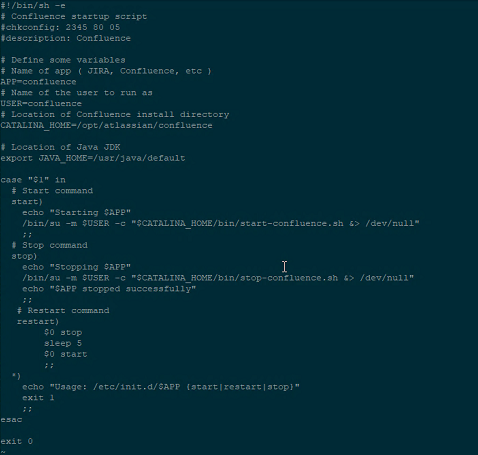
        * sudo chkconfig --add confluence
        * sudo /etc/init.d/confluence start
        * sudo /etc/init.d/confluence stop
        * 👏 issue is fixed
    * ✅Application is running 👌
    * ✅Issue with global pass authentication is fixed
        * ⚠️Redirection to Global Pass is not working, Javascript is still hard coded with the old IP address
        * Root cause 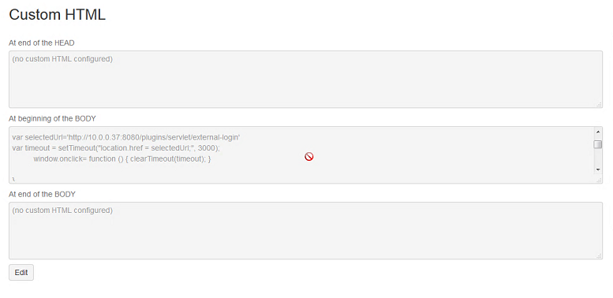
        * 👏 issue is fixed with this change 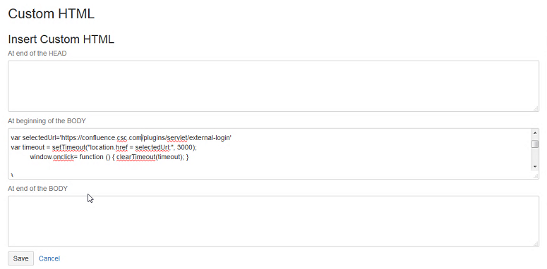
    * ✅Recreated application link from JIRA into Confluence
    * ✅Changed order of user directories (put global pass back as first over user passwords)
    * ✅Service is Live on confluence.csc.com
    * ✅Ran through Confluence test plan in GitHub
        * https://github.dxc.com/Platform-DXC/confluence/tree/master/tests
        * Attachment unit test missing in doc. Issue raised here: https://github.dxc.com/Platform-DXC/confluence/issues/66
    * ✅Configured backup on new server(s)

    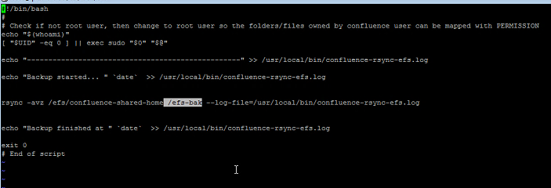
    
    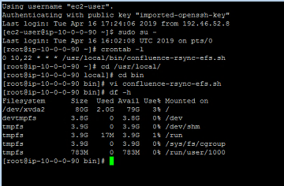
    
    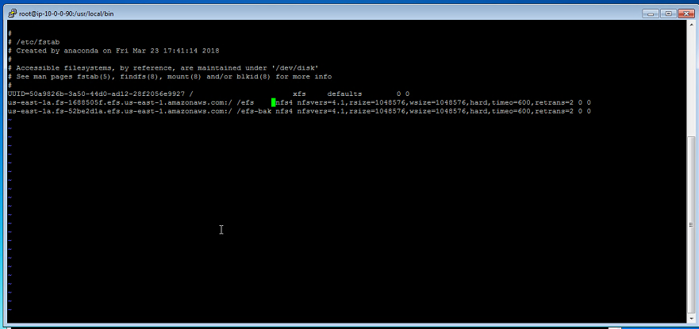
    
    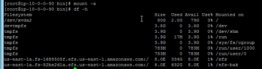
    
    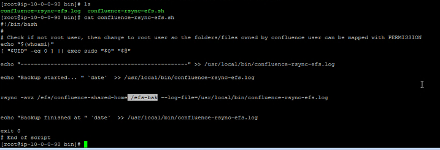
    
    * ✅Fix prometheus monitoring. [PR](https://github.dxc.com/Platform-DXC/devops-prometheus-operator/pull/17) to fix dashboard https://github.dxc.com/Platform-DXC/devops-prometheus-operator/blob/master/prometheus-operator-config/dashboards/confluence.json
 
    * ✅Put back original security group


* 2019-04-17 16:15 - Service is restored to end users.

| Activity                        | Duration   |
|---------------------------------|------------|
| Total event/unavailability time | xyz |
| Time to determine root cause    | xyz | 

## Action Plan

* [ ] Create pipeline to automate Confluence upgrade in pentest and then in production so we can upgrade faster.
* [ ] Create pipeline to automate testing after confluence upgrade so we can reduce the risk every time we upgrade.
* [ ] Update all DevCloud runbooks for a procedure to handle **critical** Security advisories. 
  * **JIRA and Confluence**: subscribe to 'Alerts' mailing list per [Atlassian advisory publishing policy](https://www.atlassian.com/trust/security/advisory-publishing-policy)
  * **GitHub**: TBD
  * **Jenkins** (done): Subscribe Microsoft Teams "Jenkins" channel to security advisories [RSS channel](https://groups.google.com/forum/feed/jenkinsci-advisories/msgs/atom_v1_0.xml).
  * **Artifactory**: TBD
  
## Lessons Learned

* Security vulnerabilities can hit hard and fast.
  * This was not a zero-day vulnerability, and was both known to our vendor and announced to their customers. However, three weeks later we still had not implemented either the appropriate patch nor recommended mitigation.
  * The DOE team was unaware of the critical vulnerability (see action plan for notification & actions)
  * As a DevOps Enablement team we know the value of fast feedback and automating via a CI/CD pipeline, but have not put it into practice for Confluence. Ideally, if Confluence was easier to patch/upgrade, the process to do so less brittle/risky, and more automated, it would have been much easier for the team to have implemented the patch much more quickly. (within a week? faster?) We knew we wanted to automate Confluence, but deprioritized it due to other work. We should have prioritized this technical debt higher to reduce risk, and drive the continual improvement which would have not only protected the service and DXC, but then allowed us to more cleanly move onto other work.
