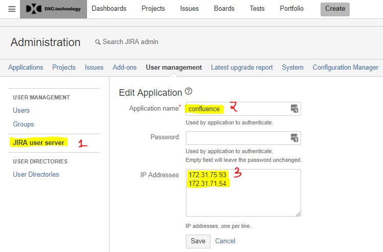
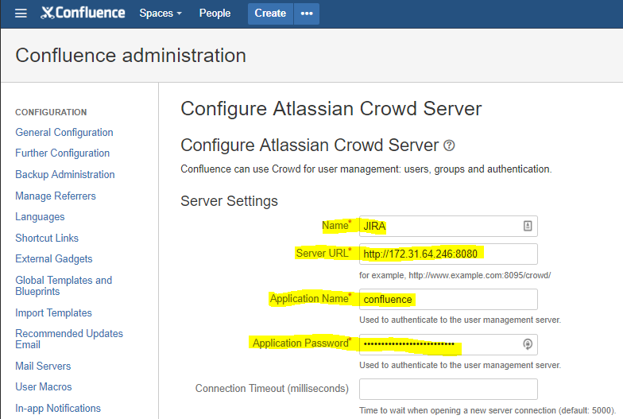
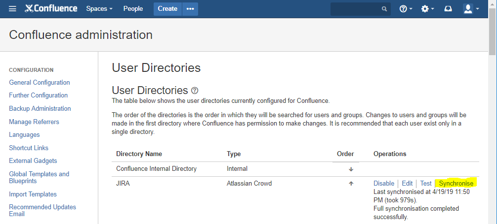

# Notes for rebuilding Confluence PenTest
## Create EC2 - Confluence Node02a in AWS DevCloud Pentest
### Use 
* RHEL 7.6 (HVM) 64-bit x86

* m4.2xlarge
* create 2 instances
* choose Subnet: subnet-a98ffcc (us-east-1a)
* same vpc
* /dev/sda1 root volume size: 80

### Add tags
* Leave Name value blank. Will add confluence-node01a-pentest later (same for node02a)

  | Key            | Value                                            |
  | -------------- | ------------------------------------------------ |
  | Name           |                                                  |
  | application-id | confluence                                       |
  | environment    | dev                                              |
  | group          | doe                                              |
  | owner          | c3321bde.CSCPortal.onmicrosoft.com@amer.teams.ms |
  

### Configure Security Group
* sg_confluence_admin (port 22 available for ssh via DXC Pulse)
* sg_safe_confluence

  | Type        | Protocol | Port Range | Source | Description | Comment |
  | ------------| -------- | ---------- | ------ | ----------- | ------- |
  | All traffic |   All    |    All     | 172.31.64.0/20 | subnet-a986ffcc--us-east-1a | Application Links between Confluence and JIRA within the same subnet |
  | SSH         |   All    |    All     | 172.31.64.0/20 | subnet-a986ffcc--us-east-1a | EC2 instances to ssh each other for file sharing, etc... within the same subnet |

### Launch and generate key-pair
* Download and save

## Review instances
Update name tags
* Name: confluence-node1a-pentest 
* Name: confluence-node2a.pentest

## Copy snapshots of production systems and share with pentest
* Confluence DB
	* Made copy of snapshot cz-mysqldb-snap-19-04-18-14-00-1555596009 to cz-mysqldb-snap-for-pentest-041819 
	* default:mysql-5-6
	* Shared privately with 057496144837  Pentest
* /opt
	* Made a copy of snap-08b3fb2bb07e14de3 to snap-0414b7227f25e6277
	* Shared privately with 057496144837  Pentest
## Restore snapshot and create volumes on pentest
* DB
	* Restore cz-mysqldb-snap-for-pentest-041819 to cz-mysqldb-pentest-20190418 DB
	* Check no for public assessible to ensure it is not on public VPC
	* Set DB Instance Class to db.m4.large
	* Left all other defaults the same
* /opt
	* Create volume of snap-0414b7227f25e6277, "For Pentest copy of confluence-node01a-prod i-01d97dacfb728ef52"
	* It created vol-0fcdc9f6ae1b6488b
	* Create a second volume
	* Add tags to each
		* Name: /opt/confluence-node01a and 02a to the second one
## Attach /opt volumes
* attach each of the /opt/ volumes to the corresponding node
* to /dev/sdf

## Connect to EC2 instances, add keys and mount volumes
### Connect and set the ssh public keys
Did the following for confluencd-node-01a-pentest and node-02a
* Generate ppk file using puttygen and the atlassian-pentest.pem
* Use WinSCP to connect
* Add all the public keys to ec2-user authorized_keys file
### confluence admin-access README
Updated README.md with latest systems
### Create confluence user
```
adduser --create-home -c "Confluence role account" confluence
```
### Mount /opt
Performed on both nodes
```
sudo yum update
sudo yum install -y nfs-utils
sudo su
lsblk #look for xvdf
mount /dev/xvdf
```
### Mount /efs
On each node as root
```
cd /
mkdir efs
mount -t nfs4 -o nfsvers=4.1,rsize=1048576,wsize=1048576,hard,timeo=600,retrans=2,noresvport fs-0af1a142.efs.us-east-1.amazonaws.com:/ efs
df -h #verify /opt and /efs
```
### Add mount into to /etc/fstab
Perform on both nodes as root
* vi /etc/fstab
* add the two lines below
```
/dev/xvdf       /opt   ext4    defaults,nofail        0       0
us-east-1a.fs-0af1a142.efs.us-east-1.amazonaws.com:/ /efs nfs4 nfsvers=4.1,rsize=1048576,wsize=1048576,hard,timeo=600,retrans=2 0 0

```
## Create startup init.d
```
cd /etc/init.d
vi confluence
```
add the following to the file
```
#!/bin/sh -e
# Confluence startup script
#chkconfig: 2345 80 05
#description: Confluence

# Define some variables
# Name of app ( JIRA, Confluence, etc )
APP=confluence
# Name of the user to run as
USER=confluence
# Location of Confluence install directory
CATALINA_HOME=/opt/atlassian/confluence

# Location of Java JDK
export JAVA_HOME=/usr/java/default

case "$1" in
  # Start command
  start)
    echo "Starting $APP"
    /bin/su -m $USER -c "$CATALINA_HOME/bin/start-confluence.sh &> /dev/null"
    ;;
  # Stop command
  stop)
    echo "Stopping $APP"
    /bin/su -m $USER -c "$CATALINA_HOME/bin/stop-confluence.sh &> /dev/null"
    echo "$APP stopped successfully"
    ;;
   # Restart command
   restart)
        $0 stop
        sleep 5
        $0 start
        ;;
  *)
    echo "Usage: /etc/init.d/$APP {start|restart|stop}"
    exit 1
    ;;
esac

exit 0
```
```
chmod +x confluence
sudo chkconfig --add confluence  # Set this file to run at the appropriate runlevel
```
## Install Java
On both nodes as root
* Use WinSCP to copy jdk-8u77-linux-x64.rpm to /tmp on both nodes
	Got it from production confluence /tmp
```
cp /tmp
rpm -ivh jdk-8u77-linux-x64.rpm
```
## Edit server.xml file
Make a backup of server.xml file and update
```
cd /opt/atlassian/confluence/conf
cp server.xml server.xml.041919
```
Change line 3 thru line 6 with the following
```
  <Connector port="8090" connectionTimeout="20000" redirectPort="8443"
    proxyName="confluencepentest.dxcdevcloud.net"
    proxyPort="443"
    scheme="https"
    secure="true"
```

## Clear old add-on cache, index, and temp files

```
# Rebuilding the Content Indexes from Scratch by deleting the content of these two folders
cd /opt/atlassian/confluence-data/index
rm -rf *

# this folder "journal" contains a lot of files so need to delete the whole folder and recreate it.  Otherwise, you might get error
cd /opt/atlassian/confluence-data
rm -rf journal
mkdir journal
chown confluence:confluence journal
chmod 700 journal

# Remove files in plugin cache folders.
cd /opt/atlassian/confluence-data/bundled-plugins
rm -rf *
cd /opt/atlassian/confluence-data/plugins-cache
rm -rf *
cd /opt/atlassian/confluence-data/plugins-osgi-cache
rm -rf *
cd /opt/atlassian/confluence-data/plugins-temp
rm -rf *

# Remove files in temp folder
cd /opt/atlassian/confluence-data/temp
rm -rf *

# Remove files in Tomcat logs folder and Confluence data logs folder
cd /opt/atlassian/confluence-data/logs
rm -rf *
cd /opt/atlassian/confluence/logs
rm -rf *
```

## Change base URL in database
* Use ssh tunnel
```
ssh -N -L 3306:cz-mysqldb-pentest-20190418.ceu54difvuaw.us-east-1.rds.amazonaws.com:3306 ec2-user@ec2-18-234-97-195.compute-1.amazonaws.com -i <your-private-key>

```
* Open MySQL Workbench and connect to DB using root password

* Perform each of these steps below in SQL

  https://confluence.atlassian.com/conf64/restore-passwords-to-recover-admin-user-rights-936511358.html
```
- Step 1. Identify Administrator

	select u.id, u.user_name, u.active from cwd_user u
	join cwd_membership m on u.id=m.child_user_id join cwd_group g on m.parent_id=g.id join cwd_directory d on d.id=g.directory_id
	where g.group_name = 'confluence-administrators' and d.directory_name='Confluence Internal Directory';

- Step 2. Replace Administrator Password	

	update cwd_user set credential = 'x61Ey612Kl2gpFL56FT9weDnpSo4AV8j8+qx2AuTHdRyY036xxzTTrw10Wq3+4qQyB+XURPWx1ONxp3Y3pB37A==' where id=1212121;

- Step 3. Put the Internal Directory in First Position
	- 327682	Confluence Internal Directory
	- 87556097	JIRA

	update cwd_app_dir_mapping set list_index = 0 where directory_id = 327682;
	update cwd_app_dir_mapping set list_index = 1 where directory_id = 87556097;
	
		
- Step 4. Add user "admin" into the 'confluence-administrators' group

	insert into cwd_membership (id, parent_id, child_user_id) 
	values (393217, 
		(select id from cwd_group where group_name='confluence-administrators' and directory_id=(select id from cwd_directory where directory_name='Confluence Internal Directory')), 1212121);

=============================================================================
- Step 5. Change base URL
Update Base URL
	update BANDANA 
	set BANDANAVALUE = replace(BANDANAVALUE, 'https://confluence.csc.com', 'https://confluencepentest.dxcdevcloud.net') 
	where BANDANACONTEXT = '_GLOBAL' 
	and BANDANAKEY = 'atlassian.confluence.settings';
	
- Step 6. Update BANDANA value of server
update BANDANA set bandanavalue = '<string>B49Q-A7IE-E18K-EYDO</string>' where bandanakey = 'confluence.server.id' and
bandanaid <> 0
```
## Change db end point in both nodes
* As root
```
cd
/opt/atlassian/confluence-data
cp cp confluence.cfg.xml confluence.cfg.xml.041919
vi confluence.cfg.xml
```
* Change to 
```
<property name="confluence.cluster.peers">172.31.75.93,172.31.71.54</property>
<property name="confluence.setup.server.id">B49Q-A7IE-E18K-EYDO</property>
<property name="hibernate.connection.url">jdbc:mysql://cz-mysqldb-pentest-20190418.ceu54difvuaw.us-east-1.rds.amazonaws.com/confluence_db</property>
```
## Start up confluence on Node 1
Login as an user "admin".
### Configuration

#### User Directories

##### On JIRA
- Go to https://jirapentest.dxcdevcloud.net/secure/admin/EditCrowdApplication.jspa?id=10200
- Click on **User management**
- Click on **JIRA user server**
- Change the following:
  - Application name = confluence
  - IP Addresses = 172.31.75.93 172.31.71.54

- Click **Save**

##### On Confluence

- Go to https://confluencepentest.dxcdevcloud.net/plugins/servlet/embedded-crowd/directories/list
- Click on **Edit**
- Change the following:
  - Name = JIRA
  - Server URL = ``` http://172.31.64.246:8080 ``` (where the 172.31.64.246 is a node 1 of JIRA Pentest.)
  - Application Name = confluence
  - Application Password = xxxxxxx

- Click on **Test Settings** button and you should see **Connection test successful** message.
- Click on **Save and Test** button
- Click on **Synchronise**

- After the **Synchronise** is finished, move the Directory Name **JIRA** to first and **Confluence Internal Directory** to second.

### ReIndexing
* Go to **General configuration**
* Click on **Content Indexing**
* Click on **Search Indexes**
* Click on **Rebuild** button


## Clone Confluence from Node 1 to Node 2
NOTE: Don't want to do this work until Node 1 indexing has completed.
* On Node 1, stop Confluence on the first node and create a tar file and copy to second node
```
    sudo su
    service confluence stop
    cd /opt
    tar -czvf atlassian-6.4.3-node1.tar.gz atlassian	
    scp -i mykey.pem /opt/atlassian-6.4.3-node1.tar.gz ec2-user@172.31.71.54:/tmp
```

* Copy the installation directory and local home directory from the first node to the next node.
```
    # copy tar file from "/tmp" folder to "/opt" folder
    cd /opt
    mv /tmp/atlassian-6.4.3-node1.tar.gz .
    chown root:root atlassian-6.4.3-node1.tar.gz
    tar -xzvf atlassian-6.4.3-node1.tar.gz
```

* Change node name from node1 to node2
```
    vi /opt/atlassian/confluence/bin/setenv.sh

    # From: CATALINA_OPTS="-Dconfluence.cluster.node.name=node1 ${CATALINA_OPTS}"
    # To:   CATALINA_OPTS="-Dconfluence.cluster.node.name=node2 ${CATALINA_OPTS}
```

* Start Confluence on second node, and confirm that you can log in and view pages on this node. 
```
    # Start confluence
    service confluence start

    # Check Tomcat log file for any errors
    tail -f /opt/atlassian/confluence/logs/catalina.out

    # Check Confluence log file for any errors
    tail -f /opt/atlassian/confluence-data/logs/atlassian-confluence.log
```

## Start up Confluence on Node 2 and validate
Login to Confluence Dashboard and confirm you are login on node2. This "node2" is displayed in the foot note like "Powered by Atlassian Confluence 6.4.3 (node2: xxxxxxxx)". Or you can check if you are on node2 by goto "Confluence administration" --> Clustering --> Confirm "node2" has circle green and with black bolded color text.

## Testing

Confirm Confluence on node 1 and node 2 are started up and perform the following:

* Verify that any Atlassian application integrations are working properly. Examples include Confluence - integrated with Jira.

* Verify that any custom integrations are working properly. Examples include Confluence integrated with SAML Authentication.

* Verify that any application's add-ons are working properly.

* Verify that the Global Pass is working properly.

* Perform a manual or automated smoke test to check the application's basic functionality and dominant use cases.

