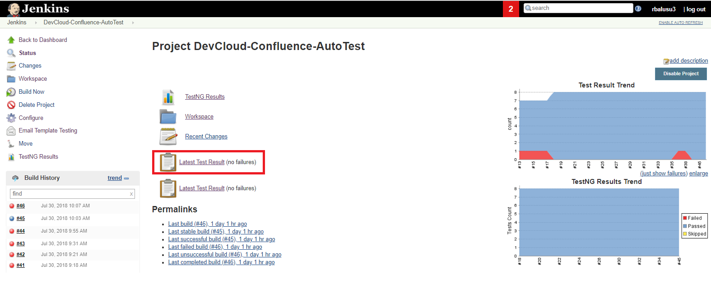
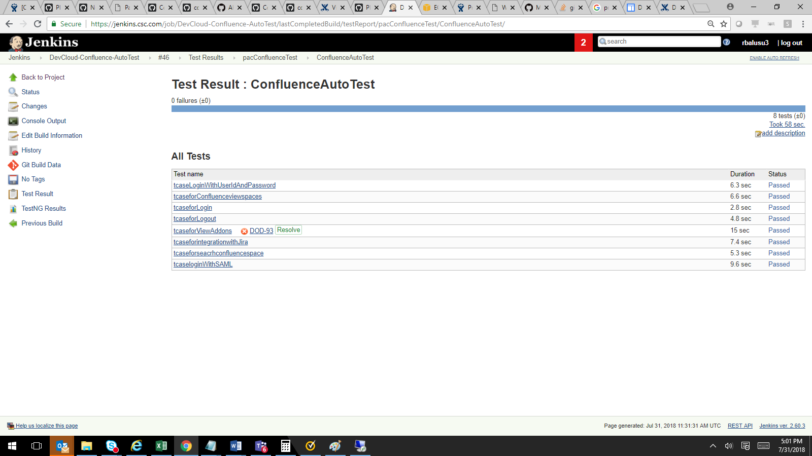

# Confluence Automation Tests
## How to install the Confluence automation Test project
1. Create the Maven project in  eclipse or any Java editor
2. Clone the project from Github 
3. Please open the Pom.XML file and refresh and it will create the maven dependecy folder and download all required jar files.

## How to Test the Confluence Automation Test project
from Jenkins
1. Login to Jenkins.csc.com
2. Search the  DevCloud-Confluence-AutoTest job from Jenkins Dashboard
3. Open the DevCloud-Confluence-AutoTest Job
4. Click on Build Now option from the Jenkins Dashboard
5. Once completed you can see the Test result report by clicking the Latest Test Result link which will appear in Jenkin Dashboard
6. You can see all the Test cases results i.e How many passed and how many failed
7. For all failed Testcases Jenkins will create the Jira issues and that you can see the in the Latest Test results
8. Once the issues fixed and re run the job and issues will automatically resolved if the fix works

## Executing the Jenkins Job from JIRA
1. Login to JIRA using DXC global credentials i.e: https://jira.csc.com
2. Search the CZSD-11600 in JIRA
3. When the user clicks on ExecuteTestcase transistion, the jenkins job will be triggered
4. Login to Jenkins using DXC global pass credentials i.e https://jenkins.csc.com/job/DevCloud-Confluence-AutoTest/ 
5. Click on Latest test results and see how many test passed and how many failed  
 
 
